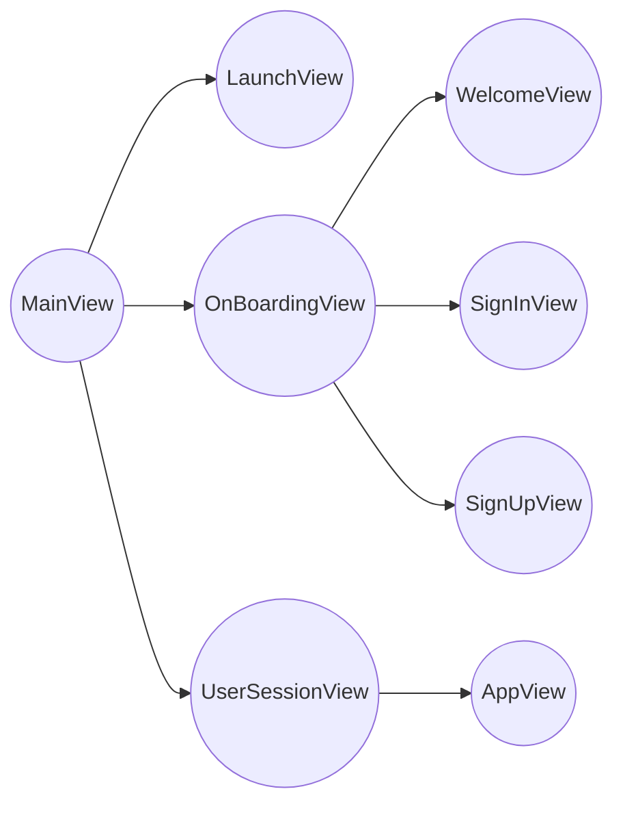
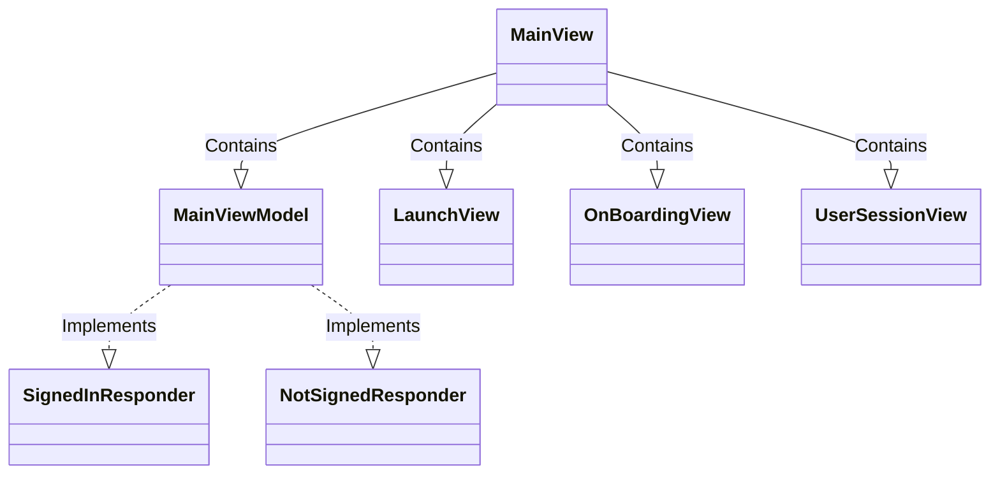
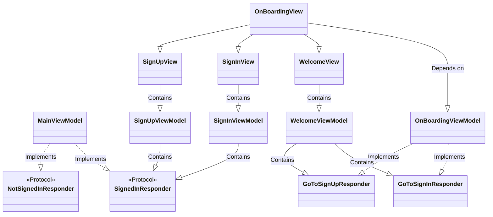
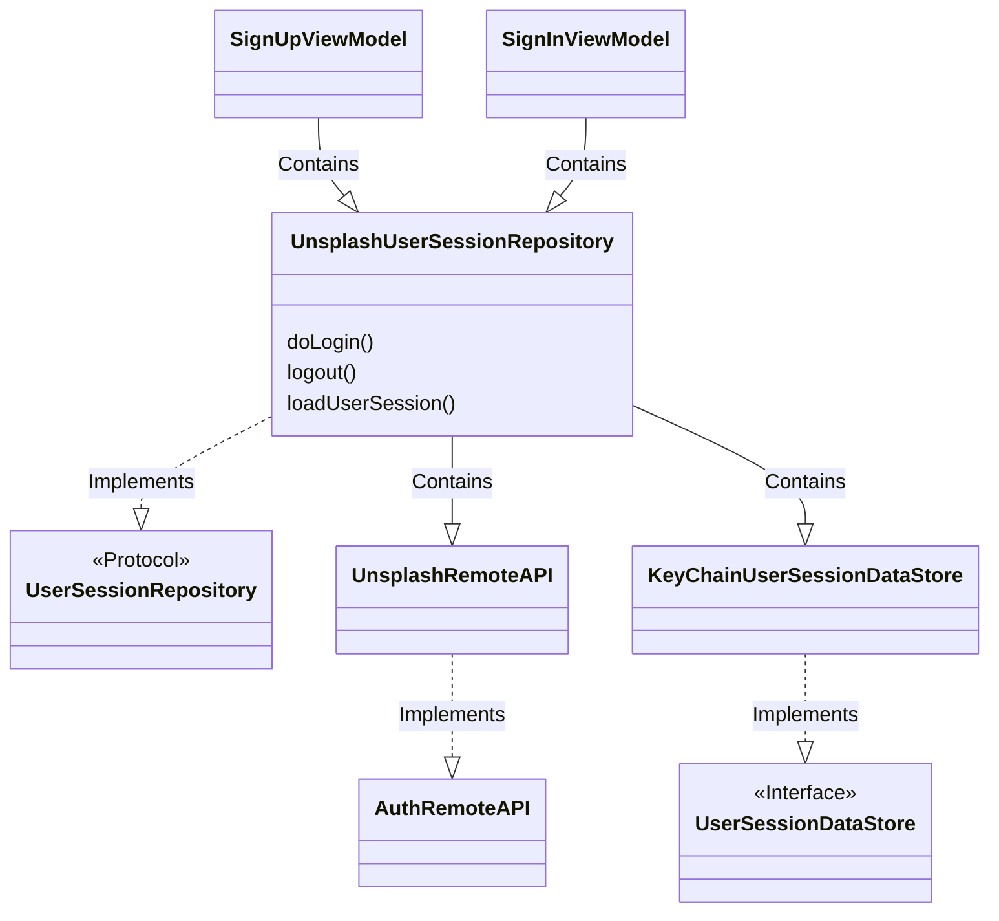

# User Login Story

One of the first operations the app does just after initializing is ti decide whether the user is logged In  or Out.

This operations involves a synchronization between UI and Backend components, the UI responsibilities will include showing a LaunchView will the backend consults if there is a user session available, provide the user with the UI workflow for Login in case the user session expired and also it should re-direct the user to the App Home View in case the UserSession is still valid.

## UI Views Hierarchy

## View Models

Synchronization with Views will require the ViewModels to coordinate basically 2 types of activities

- Navigation: Management of  Signals that activates changes between views
- State: Reading and Writing Signals to Local and Remote systems. For example, we will use the Repository Pattern to provide a Layer so the app can connect  with the API service (Unsplash API) to check the UserSession state.

Diagram below describes the Dependency Graph for the involved View Models

### The MainView and MainViewModel

The MainViewModel is at the top of our hierarchy, as such it will beed to assume the responsibility to change between: **LaunchView, OnBoardingView and UserSessionView**.

So the MainView is just a container that will handle 3 views, and the MainViewModel is the one responsible to substitute each view according with the UserSession State.

When the app opens the **MainViewModel** will set the **LaunchView** as initial View.

If the UserSession is alive, the **MainViewModel** will set the **UserSessionView** (which contains the app) acting as the **SignedInResponder** protocol

If the UserSession doesn’t exist, the **MainViewModel** will set the **OnBoardingView** acting as the **NotSignedInResponder** protocol

### The OnBoardingView and OnBoardingViewModel

When the user session doesn’t exist, the user will need to be redirected to the onboarding workflow. Here the user can perform two actions: Login or SignIn. 

In the same manner as the **MainViewModel**,  the **OnBoardingViewModel** will take responsibility to control this workflow using 2 protocols: **GoToSignInResponder** and **GoToSignUpResponder.**

This **OnBoardingViewModel** will be implemented by the **WelcomeViewModel**, because the WelcomeView will be the one presenting 2 options: SignIn or SignUp.

Both The **SignUpViewModel** and the **SignInViewModel** will need a reference to the ViewModel Activating the **SignedInResponder(MainViewModel)** to indicate the user has created a new UserSession and update the Screen, this means the **MainViewModel** will be a Long-Lived dependency that we will need to manage.

### UserSessionRepository

**SignUpViewModel** and **SignInViewModel** responsibilities are constrained to create and store the new userSession. These activities require of a Repository to interact with the App State (Online for creating the UserSession and Local to storage). In this example we decide to store the user session in the keyChain, so we named **KeyChainUserSessionDataStore** the implementation of the protocol **UserSessionDataStore**

